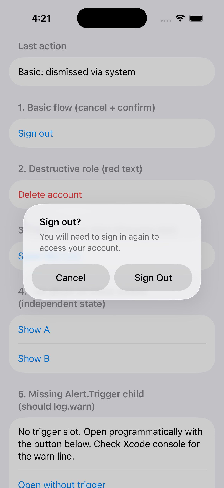
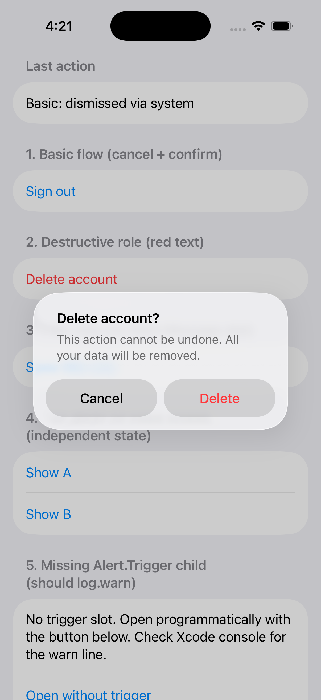
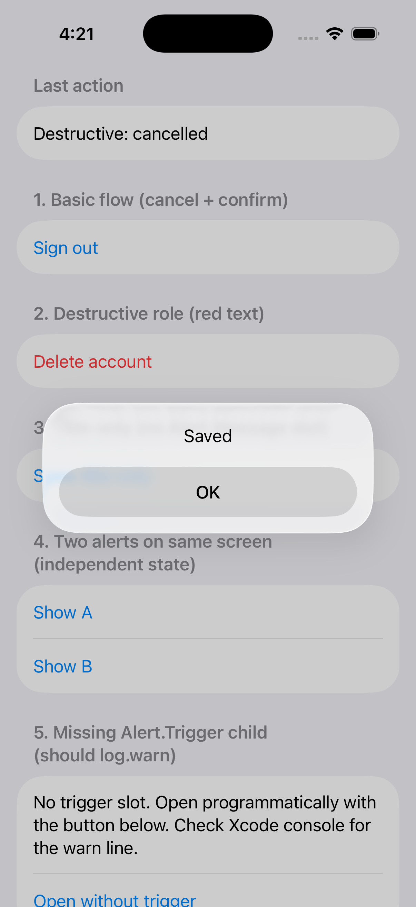
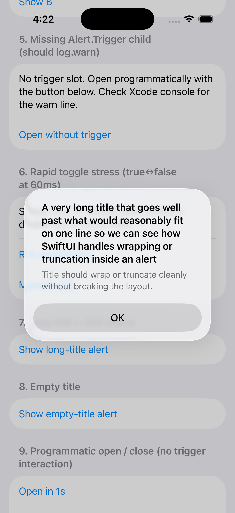
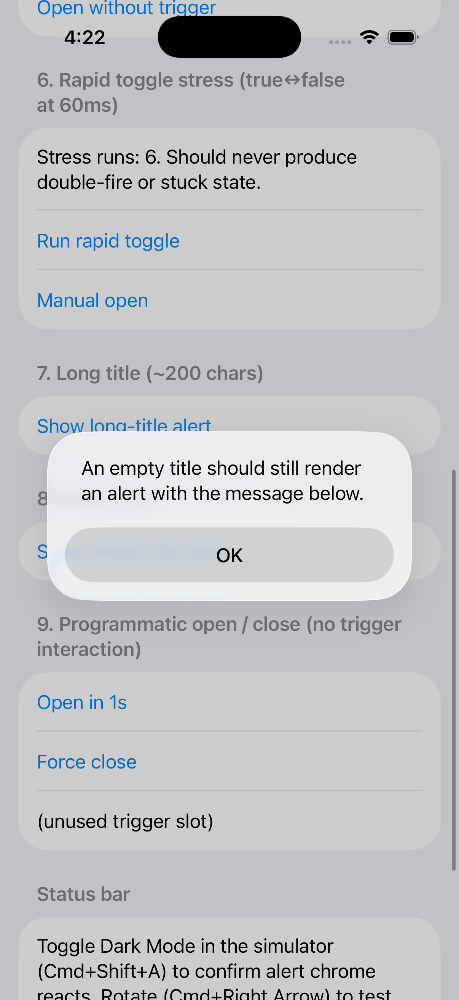
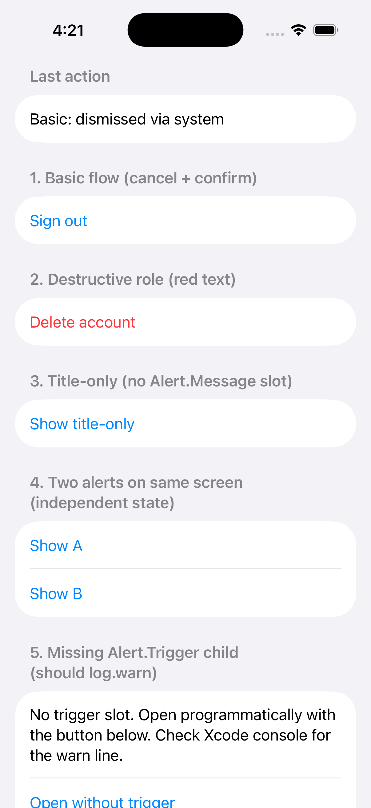

# expo-ui-alert-45700-repro

Wanted to use a SwiftUI Alert from `@expo/ui/swift-ui` on iOS but the package ships `ConfirmationDialog` (action sheet) and `BottomSheet` and no `Alert`. The fix was sitting half-staged in the expo monorepo: `apps/native-component-list/src/screens/UI/AlertDialogScreen.ios.tsx` was a "Not implemented yet on iOS" placeholder paired with a working Android `AlertDialogScreen.android.tsx` rendering `AlertDialog` from `@expo/ui/jetpack-compose`. Filed the iOS half as [`expo/expo#45700`](https://github.com/expo/expo/pull/45700). This repo is the runnable consumer-side repro: fresh `create-expo-app@canary` with the patched `@expo/ui` installed locally, twelve test cards on the home screen exercising every Alert edge case.

The patch mirrors `ConfirmationDialog` (#43366) byte-for-byte minus `titleVisibility`, so anything that already works with `ConfirmationDialog` works the same way here.

| Basic flow | Destructive role | Title only |
|---|---|---|
|  |  |  |

| Long title (~200 chars) | Empty title | Home screen |
|---|---|---|
|  |  |  |

## Run

You need Xcode with an iOS simulator (or device) and Bun.

```bash
bun install
bun run prebuild
bun run ios
```

First build takes 5-10 minutes while Xcode compiles the dev client and `libExpoUI.a` with the new `AlertView.swift`. After that, JS edits hot-reload through Metro.

## What's on the home screen

Each card mounts one `Alert` configuration and exercises a specific scenario. The "Last action" row at the top updates after every interaction so you can confirm the JS state sync path.

| # | Card | What to confirm |
|---|---|---|
| 1 | Basic flow (cancel + confirm) | Trigger opens alert centered. `Sign Out` records `Basic: confirmed`. Cancel role sits at the bottom. Tapping an action dismisses the alert. |
| 2 | Destructive role | Both trigger and inner `Delete` render red. |
| 3 | Title-only | No message slot. Alert renders title + single OK. |
| 4 | Two alerts on same screen | A and B have independent state. Opening A does not affect B. |
| 5 | Missing `Alert.Trigger` | Opens programmatically. Xcode console emits `Alert requires an Alert.Trigger child to be visible`. |
| 6 | Rapid toggle stress | Flips `isPresented` six times at 60ms intervals. Alert lands open. No double-fire, no stuck state. |
| 7 | Long title (~200 chars) | Title wraps or truncates without breaking the centered layout. |
| 8 | Empty title | No title row, message + button still render. |
| 9 | Programmatic open / close | Driven entirely by external state. "Open in 1s" delay-fires. "Force close" dismisses without a user tap. |

## System-state checks

These need simulator settings changes, not just in-app interaction.

| Setting | Where | What to confirm |
|---|---|---|
| Dark mode | `Cmd+Shift+A` in the simulator | Alert chrome flips dark, text legible, buttons visible. |
| Landscape | `Cmd+Right Arrow` | Alert re-centers, doesn't clip. |
| Dynamic Type AX5 | `Settings → Accessibility → Display & Text Size → Larger Text → drag to max` | Alert title and message scale up. |
| iOS 15 (minimum SDK) | Boot an iOS 15 sim, `bun run ios` | `.alert(_:isPresented:actions:message:)` works on the lowest supported iOS. |

## Versions pinned

- `expo` `56.0.0-canary-20260506-03817f5` (or any later canary)
- `react` `19.2.3`, `react-native` `0.85.3`
- `@expo/ui` `56.0.5` from the patched build at `./expo-ui-56.0.5.tgz`

`package.json` references the patched build via `"@expo/ui": "file:./expo-ui-56.0.5.tgz"`. `bun install` picks it up on every install.

## What the patch changes

`patches/PR-45700.patch` is the source diff filed upstream as [`expo/expo#45700`](https://github.com/expo/expo/pull/45700). 17 files, +673 / -8. Adds:

- `packages/expo-ui/src/swift-ui/Alert/index.tsx` — JS bridge with `Alert.Trigger`, `Alert.Actions`, `Alert.Message` slots
- `packages/expo-ui/ios/Alert/AlertView.swift` — SwiftUI view applying `.alert(props.title, isPresented: $isPresented, actions:, message:)`
- `packages/expo-ui/ios/Alert/AlertProps.swift` — `title`, `isPresented`, `onIsPresentedChange` event dispatcher
- `docs/pages/versions/{unversioned,v55.0.0}/sdk/ui/swift-ui/alert.mdx` plus generated API data
- `apps/native-component-list/src/screens/UI/AlertDialogScreen.ios.tsx` replacing the "Not implemented yet" placeholder with the same four variants you see in this repro
- Module registration in `ios/ExpoUIModule.swift`, export from `src/swift-ui/index.tsx`, gdad mapping in `tools/src/commands/GenerateDocsAPIData.ts`, CHANGELOG entry

Rebuilding the patched `@expo/ui` from the PR branch:

```bash
git clone https://github.com/expo/expo.git
cd expo
git fetch origin pull/45700/head:feat/expo-ui-swift-ui-alert
git checkout feat/expo-ui-swift-ui-alert
pnpm install
cd packages/expo-ui
pnpm build
npm pack --pack-destination /path/to/this/repro/
```

## License

MIT.
